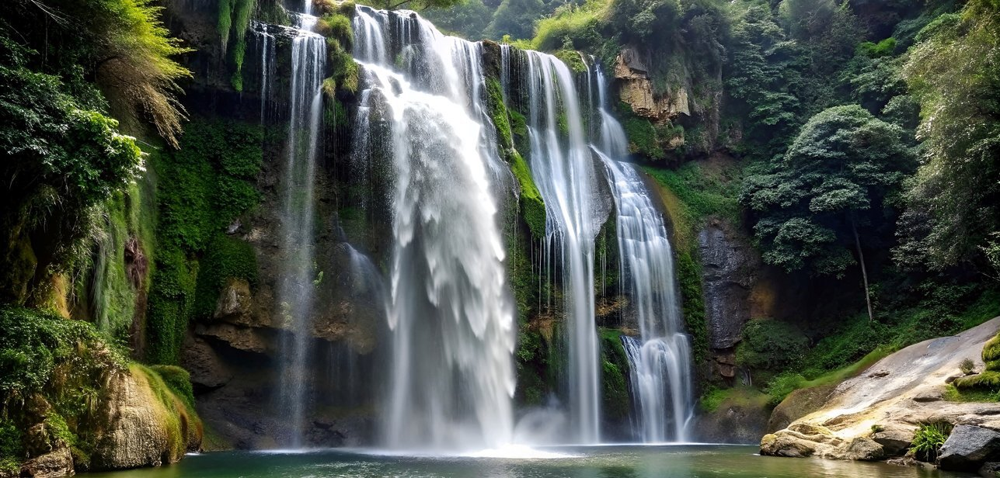
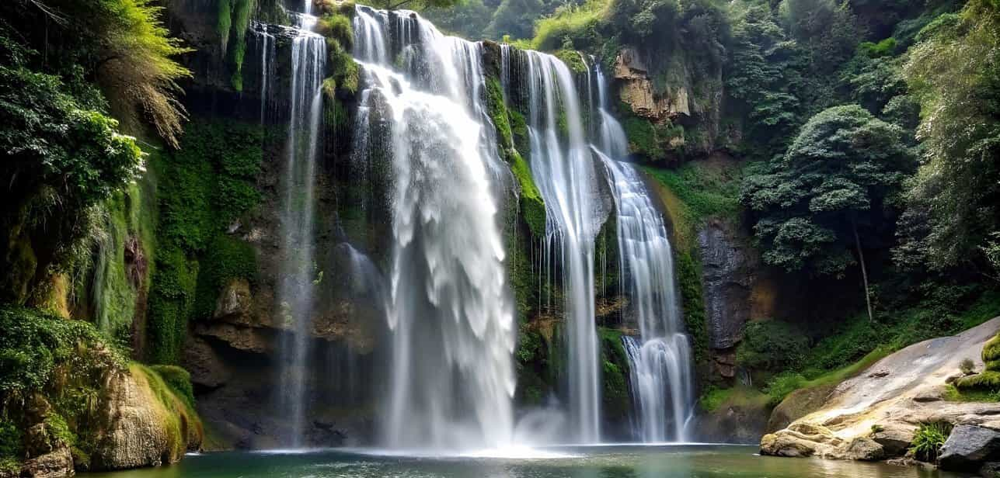
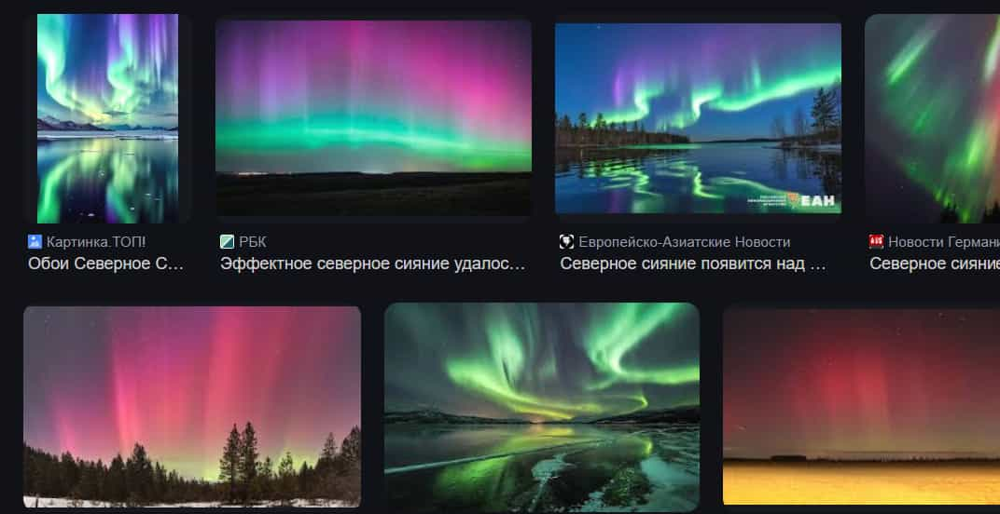
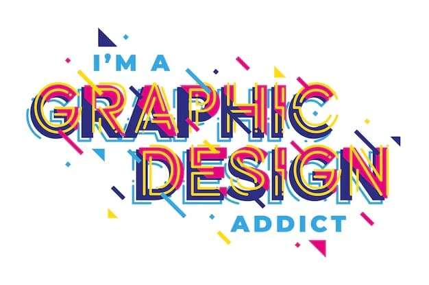
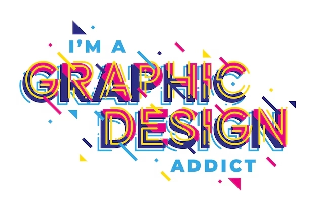
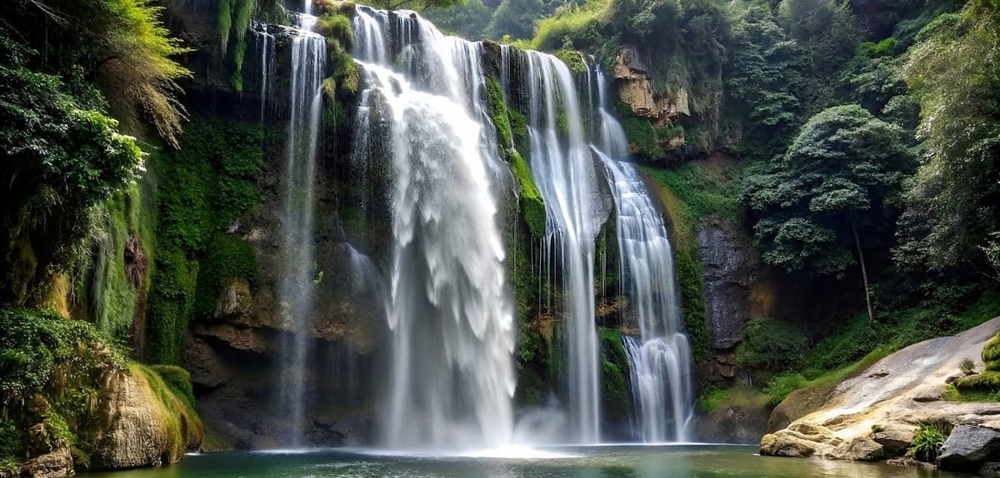
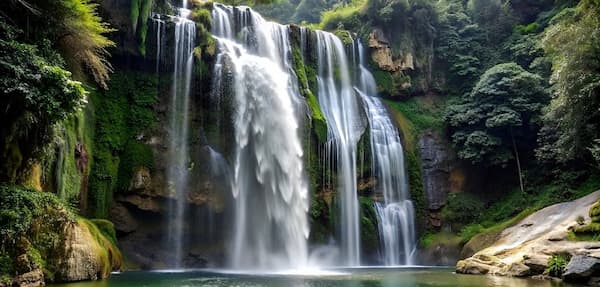

# Оптимізація зображень за допомогою Squoosh
## Початкові зображення
Моі початкові зображення мають формати **jpeg**, **png** та **jpg**.

| Назва файлу | Формат | Розмір (px) | Вага (kb) |
|-------------|--------|-------------|-----------|
| photo.jpeg | JPEG | 1287x616 | 240 |
| screenshot.png | PNG | 1072x552 | 600 |
| graphic.jpg | JPG | 626x417 | 129 |

**Фото:**  
  

**Скриншот:**  
  

**Графічне зображення з текстом:**  
  

## Стиснення без втрати якості (lossless)
**Фото у форматі PNG (lossless)**

**Фото у форматі WebP (lossless)**

**Скриншот у форматі PNG (lossless)**

**Скриншот у форматі WebP (lossless)**

**Графічне зображення з текстом у форматі PNG (lossless)**

**Графічне зображення з текстом у форматі WebP (lossless)**

### Порівняння розмірів файлів після lossless стиснення
| Назва файлу | Розмір | Вага оригіналу | Вага після стиснення у PNG | Вага після стиснення у WebP |
|-------------|--------|----------------|----------------------------|-----------------------------|
| photo.jpeg  | 1287x616 | 240 кб | 1,54 мб | 907 кб |
| screenshot.png | 1072x552 | 600 кб | 626 кб | 333 кб |
| graphic.jpg | 626x417 | 129 кб | 227 кб | 146 кб |

## Стиснення з втратою якості (lossy)
### Фото
**Фото в форматі MozJPEG (стиснення з 100% рівнем якості)**

**Фото в форматі MozJPEG (стиснення з 75% рівнем якості)**

**Фото в форматі MozJPEG (стиснення з 50% рівнем якості)**

**Фото в форматі WEbP (стиснення з 100% рівнем якості)**

**Фото в форматі WEbP (стиснення з 75% рівнем якості)**

**Фото в форматі WEbP (стиснення з 50% рівнем якості)**

**Фото в форматі AVIF (стиснення з 100% рівнем якості)**

**Фото в форматі AVIF (стиснення з 75% рівнем якості)**

**Фото в форматі AVIF (стиснення з 50% рівнем якості)**

### Скриншот
**Скриншот в форматі MozJPEG (стиснення з 100% рівнем якості)**

**Скриншот в форматі MozJPEG (стиснення з 75% рівнем якості)**

**Скриншот в форматі MozJPEG (стиснення з 50% рівнем якості)**

**Скриншот в форматі WEbP (стиснення з 100% рівнем якості)**

**Скриншот в форматі WEbP (стиснення з 75% рівнем якості)**

**Скриншот в форматі WEbP (стиснення з 50% рівнем якості)**

**Скриншот в форматі AVIF (стиснення з 100% рівнем якості)**

**Скриншот в форматі AVIF (стиснення з 75% рівнем якості)**

**Скриншот в форматі AVIF (стиснення з 50% рівнем якості)**

### Графічне зображення з текстом
**Графічне зображення з текстом в форматі MozJPEG (стиснення з 100% рівнем якості)**

**Графічне зображення з текстом в форматі MozJPEG (стиснення з 75% рівнем якості)**

**Графічне зображення з текстом в форматі MozJPEG (стиснення з 50% рівнем якості)**

**Графічне зображення з текстом в форматі WEbP (стиснення з 100% рівнем якості)**

**Графічне зображення з текстом в форматі WEbP (стиснення з 75% рівнем якості)**

**Графічне зображення з текстом в форматі WEbP (стиснення з 50% рівнем якості)**

**Графічне зображення з текстом в форматі AVIF (стиснення з 100% рівнем якості)**

**Графічне зображення з текстом в форматі AVIF (стиснення з 75% рівнем якості)**

**Графічне зображення з текстом в форматі AVIF (стиснення з 50% рівнем якості)**

| Формат  | Назва файлу | Вага оригіналу | 100% | 75% | 50% |
|:-------:|:-----------:|:--------------:|:---:|:--:|:--:|
| MozJPEG | photo.jpeg | 240 кб | 571 кб | 138 кб | 83 кб |
|         | screenshot.png | 600 кб | 350 кб | 55 кб | 36 кб |
|         | graphic.jpg | 129 кб | 150 кб | 30 кб | 21 кб |
| WebP    | photo.jpeg | 240 кб | 431 кб | 158 кб | 119 кб |
|         | screenshot.png | 600 кб | 133 кб | 37 кб | 29 кб |
|         | graphic.jpg | 129 кб | 59 кб | 23 кб | 19 кб |
| AVIF    | photo.jpeg | 240 кб | 395 кб | 200 кб | 120 кб |
|         | screenshot.png | 600 кб | 154 кб | 45 кб | 23 кб |
|         | graphic.jpg | 129 кб | 60 кб | 26 кб | 16 кб |

### При стисненні на різних рівнях якості розмір зображення не змінюється, а ось вага - так. Стиснення з втратою якості (lossy) впливає на якість зображення та його вагу, але розмір у пікселях залишається незмінним. Для MozJPEG мінімально рівень якості є 75%, тому що при 50% помітна значна втрата деталей, для WebP також 75%, тому що 50% викликає розмитість і втрату різкості, а ось AVIF 50% виглядає цілком прийнятно, з мінімальними втратами візуальної якості.

## Оптимізація розміру відповідно до цільового використання
### Для вебу: 
**Фото з шириною 1200px**

**Скриншот з шириною 1200px**

**Графічне зображення з текстом з шириною 1200px**

| Назва файлу | Розмір | Вага оригіналу | Розмір після оптимізації | Вага після оптимізації |
|-------------|--------|----------------|--------------------------|------------------------|
| photo.jpeg  | 1287x616 | 240 кб | 1200х574 | 119 кб |
| screenshot.png | 1072x552 | 600 кб | 1200х618 | 63,7 кб |
| graphic.jpg | 626x417 | 129 кб | 1200х799 | 68,9 кб |

### Для мобільних простроїв
**Фото з шириною 600px**  

**Скриншот з шириною 600px**  

**Графічне зображення з текстом з шириною 600px**  

| Назва файлу | Розмір | Вага оригіналу | Розмір після оптимізації | Вага після оптимізації |
|-------------|--------|----------------|--------------------------|------------------------|
| photo.jpeg  | 1287x616 | 240 кб | 600х287 | 32,7 кб |
| screenshot.png | 1072x552 | 600 кб | 600х309 | 23,8 кб |
| graphic.jpg | 626x417 | 129 кб | 600х400 | 27,9 кб |

### Для Retina-дисплеїв
**2х версія фото**

**2х версія скриншоту**

**2х версія графічного зображення з текстом**

| Назва файлу | Розмір | Вага оригіналу | Розмір після оптимізації | Вага після оптимізації |
|-------------|--------|----------------|--------------------------|------------------------|
| photo.jpeg  | 1287x616 | 240 кб | 2574х1232 | 393 кб |
| screenshot.png | 1072x552 | 600 кб | 2144х1104 | 139 кб |
| graphic.jpg | 626x417 | 129 кб | 1252х834 | 71,9 кб |

## Висновки
### Найкращі формати для різних типів зображень:
**Фотографії:** Оптимальні формати — JPEG (або WebP, AVIF); JPEG добре стискає фото, зберігаючи деталізацію, тоді як WebP і AVIF забезпечують ще кращу компресію при мінімальній втраті якості.
**Скріншоти:** Рекомендується PNG (або WebP); PNG гарантує чітку передачу дрібних деталей, а WebP може дати менший розмір файлу без значної втрати якості.
**Графічні зображення з текстом:** Найкраще підходить PNG, оскільки цей формат зберігає чіткість ліній і тексту.

### Вплив зміни розміру на оптимізацію:
Зменшення розмірів зображення знижує його вагу, що прискорює завантаження сторінок. Якщо картинка надто велика для екрана, браузеру доводиться витрачати ресурси на її масштабування, що уповільнює роботу.

### Адаптація для Retina-дисплеїв:
**Фотографії:** Формати WebP або AVIF, збереження у 2x чи 3x розмірах. Наприклад, для відображення 500×500px зображення слід підготувати у 1000×1000px.
**Скріншоти:** Зберігати у вихідній роздільній здатності або створювати 2x версії для збереження чіткості.
**Графічні зображення з текстом:** Використовувати PNG високої роздільної здатності — у 2–3 рази більші за стандартний розмір.
