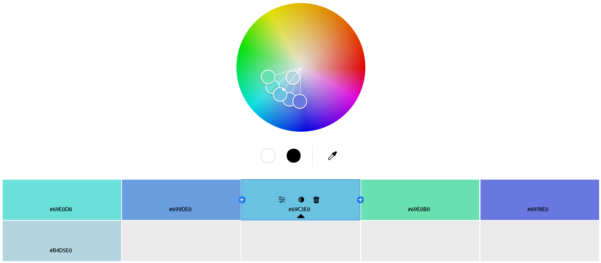
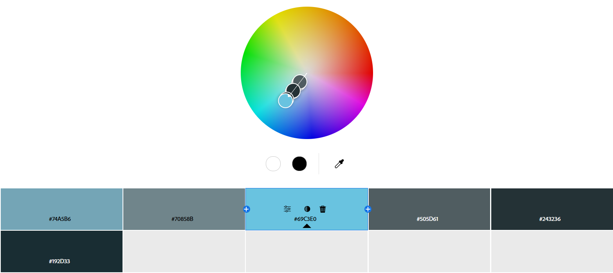
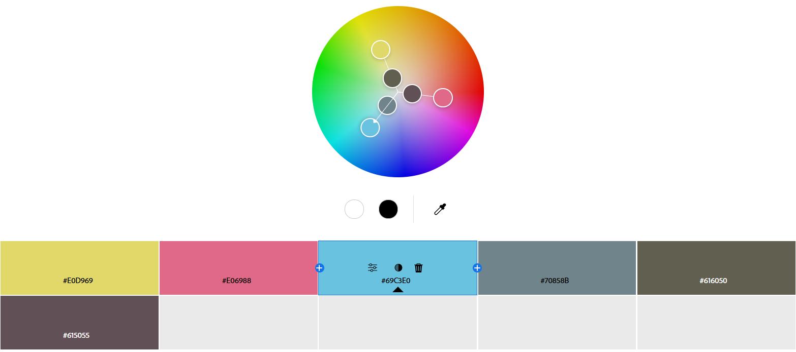
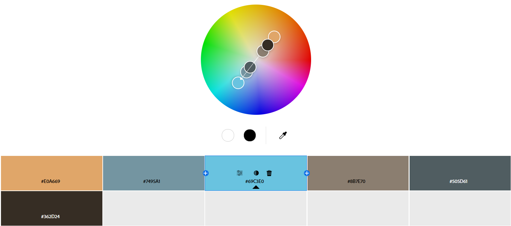
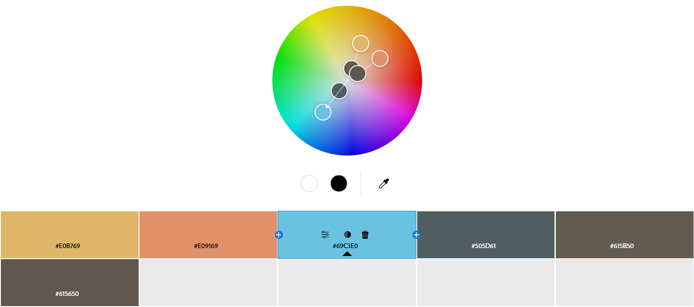
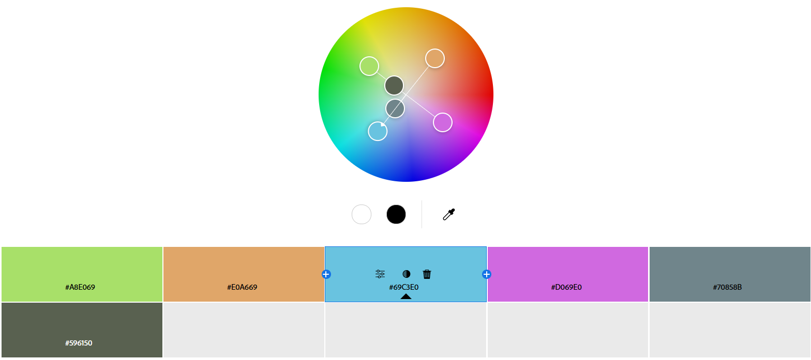
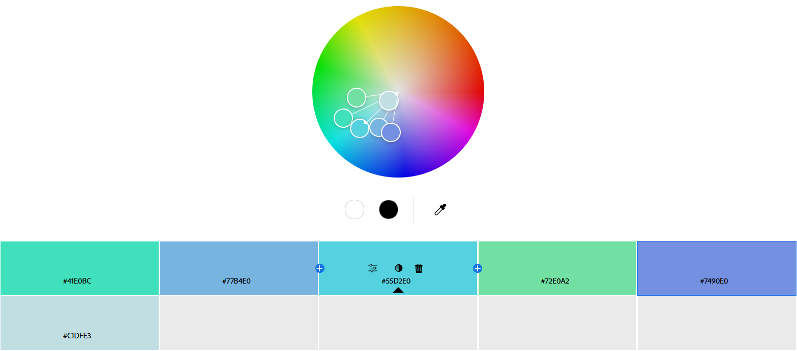

# Дослідження кольорових гармоній та інструментів аналізу кольору в Adobe Color

## Скріншоти палітр
Базовий колір: ***69C3E0***

- **Analogous:**
  - 
  - *Логіка:* Використовуються відтінки, які знаходяться близько один до одного на колірному колі — це дає природне візуальне перетікання між кольорами.
  - *Ефект:* Створює враження єдності та плавного переходу між елементами. Відсутність сильного контрасту створює затишну атмосферу.
- **Monochromatic:**
  - 
  - *Логіка:* Побудована на варіаціях одного й того ж кольору — грається з його глибиною та яскравістю, не змінюючи тон.
  - *Ефект:* Виглядає стильно й стримано. Немає візуального конфлікту, але без структурних відмінностей все може «злитися» в одну пляму.
- **Triad:**
  - 
  - *Логіка:* Обираються три кольори, які утворюють рівносторонній трикутник на колірному колі — вони різні, але мають рівновагу.
  - *Ефект:* Дає живу, збалансовану картинку з помітними, але несуперечливими акцентами. Яскраво та без візуального хаосу.
- **Complementary:**
  - 
  - *Логіка:* Комбінація кольорів, що стоять напроти один одного на колі — вони максимально контрастні, але добре поєднуються.
  - *Ефект:* Максимальна помітність завдяки контрасту. Це ефективно, коли треба щось підкреслити, але може втомлювати око при зловживанні.
- **Split Complementary:**
  - 
  - *Логіка:* Базовий колір доповнюється двома іншими, які сусідять із його прямою протилежністю на колі — збалансований, але контрастний підхід.
  - *Ефект:* Має енергію та контраст, але поводиться м’якше. Це як компроміс між стриманістю та виразністю — добре працює, коли хочеться щось виділити.
- **Square:**
  - 
  - *Логіка:* Обираються чотири кольори з однаковим інтервалом на колірному колі — палітра рівновіддалених відтінків у всіх напрямках.
  - *Ефект:* Як правило, це хороший вибір, коли потрібно створити яскраве та барвисте зображення, але потрібно бути обережним, щоб не допустити перенасичення.
- **Custom:**
  - 
  - *Логіка:* Кольори підібрані інтуїтивно або під певну ідею, без прив’язки до класичних колірних схем — це персоналізований вибір, що передає настрій.
  - *Ефект:* В моєму випадку надає відчуття динаміки, енергії й сучасності, але зберігає свіжість і легкість. Ідеально пасує для технологічних або молодіжних проєктів, де потрібен яскравий, але не агресивний настрій.
